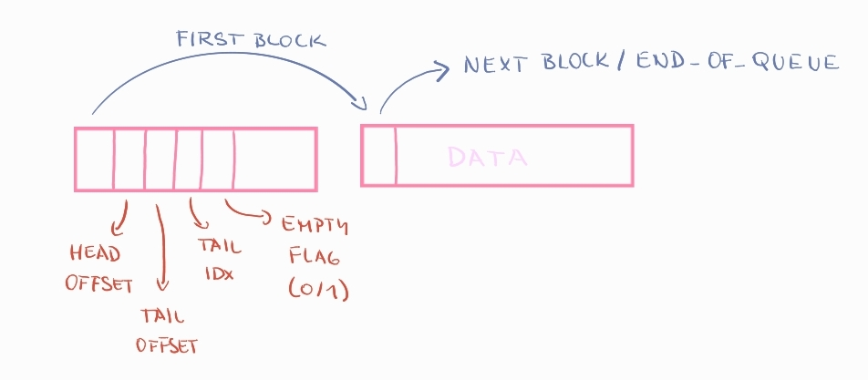

# byteQueue implementation
***
Implementation of home task in C++

***Given problem:***

The problem is to write a set of functions to manage a variable number of byte queues, each with variable length, in a small, fixed amount of memory. You should provide implementations of the following four functions:

```
Q *create_queue(); // Creates a FIFO byte queue, returning a handle to it.
void destroy_queue(Q *q); // Destroy an earlier created byte queue.
void enqueue_byte(Q *q, unsigned char b); // Adds a new byte to a queue.
unsigned char dequeue_byte(Q *q); // Pops the next byte off the FIFO queue.
```
So, the output from the following set of calls:
```
Q *q0 = create_queue();
enqueue_byte(q0, 0);
enqueue_byte(q0, 1);
Q *q1 = create_queue();
enqueue_byte(q1, 3);
enqueue_byte(q0, 2);
enqueue_byte(q1, 4);
printf("%d", dequeue_byte(q0));
printf("%d\n", dequeue_byte(q0));
enqueue_byte(q0, 5);
enqueue_byte(q1, 6);
printf("%d", dequeue_byte(q0));
printf("%d\n", dequeue_byte(q0));
destroy_queue(q0);
printf("%d", dequeue_byte(q1));
printf("%d", dequeue_byte(q1));
printf("%d\n", dequeue_byte(q1));
destroy_queue(q1);
```
should be:
```
0 1
2 5
3 4 6
```
You can define the type Q to be whatever you want.

Your code is not allowed to call malloc() or other heap management routines.
Instead, all storage (other than local variables in your functions) must be within a provided array:
```
unsigned char data[2048];
```
Memory efficiency is important. On average while your system is running, there will be about 15 queues with an average of 80 or so bytes in each queue. Your functions may be asked to create a larger number of queues with less bytes in each. Your functions may be asked to create a smaller number of queues with more bytes in each.

Execution speed is important. Worst-case performance when adding and removing bytes is more important than average-case performance.

If you are unable to satisfy a request due to lack of memory, your code should call a provided failure function, which will not return:
```
void on_out_of_memory();
```
If the caller makes an illegal request, like attempting to dequeue a byte from an empty queue, your code should call a provided failure function, which will not return:
```
void on_illegal_operation();
```
There may be spikes in the number of queues allocated, or in the size of an individual queue. Your code should not assume a maximum number of bytes in a queue (other than that imposed by the total amount of memory available, of course!) You can assume that no more than 64 queues will be created at once.
***
## Explanation of my solution

**WHAT DO WE KNOW:**
- 64 is the maximum number of queues 
- WORST-CASE of enqueue/dequeue is important
- Focus also on memory efficiency

**NOTES:**

We **don't** know the number of queues or cannot assume min. Also, we need something to manage variable length of each queue.

It would be good to keep O(1) worst-case scenario for enqueue/dequeue. So it's important to keep somewhere information about each queue.

We add elements one by one, we want to use as much given memory as we can, but it cannot be 100%. So let's try to minimize it.

1. This task led me to think about efficient memory allocation. If we wanted to maximize memory usage by adding all elements by one, we would lose
a lots of data, because for each element we would need information: to which queue this element belongs to and where in the queue it's placed.
2. So it does not make sense to place elements by one. Better solution is to use blocks of data. We need to initialize all blocks that we will use.
But to use different sizes of blocks (like in buddy system allocation) we don't have enough information, so it's also not suitable for this task.
3. The best solution (after considering all scenarios above) for this task is to use blocks with static size. In each block we need to store information, so we need to optimize, which inormation 
is important for each block and optimize the size of it, so we can store as much data as we can.

Blocks of data should be reusable, for this we will keep **list of free blocks**.

**For each queue, we need to know:**

- where is "head"

- where is "tail"

- which blocks are in this queue

My first idea was to store info in first 3 bytes (then because I needed also empty flag I decided to use 4), but that would waste a lot of memory. After dequeue and freeing first block, I would need to put information
about head and tail into the next block, so in each block I would need 3 bytes.

Then I realised we can have "head block" that can store everything important, so each block would need only 1 byte (next block link). That would also waste some memory,
but it's a fair trade I had to make. 

**This is how my queue looks like:**



I need only 1 byte for offset bcs the maximum number is 8 (for each block). (I could store both offsets in one byte, but there is enough space in the head block to afford this)
For information which block tail is the minimum size of block will be 8 (otherwise it would not make sense, I would waste a lot of data) - 2048/8 = 256
So there will be no more than 256 blocks - which is perfect because I can save only index of block (we can get pointer easily) and 1 byte is enough.

**Another important decision is to choose the size of blocks**

My first idea was 16 (32 was too big and 8 seemed not enough):
- During initialization, each block has "next index" and we fill our free list. So we use 128 bytes. 2048-128 = 1920 free bytes
- For each queue we need 1 head block (16) - 4 of them handle information, 12 of them are wasted
- 64 small queues: 1920-64*15 = 960 - that's what's left for data
- average (15 queues, 80-ish data): 1920-15*15 = 1695 - for that we have enough space
- for 1 big queue: 1920-15 = 1905 is available

Case with 64 small queues takes big amount of memory. So I tried to count if 8 would be better.
- For each queue we need 1 head block (8) - so we won't waste that much
- Init: 256 maximum of queues: 2048-256 = 1792
- 64 small queues: 1792-448 = 1344 (much more available)
- average (15 queues, 80-ish data): 1792-15*7 = 1694 - almost the same
- for 1 big queue: 1792 - 7 = 1785 (smaller but not as different as with smaller queues)

Then I decided it's much more efficient to use 8bytes blocks. 

***Another problem:*** Maximum idx is 255, but for next link I wanted to use 255 as "END_OF_QUEUE". With that I decided not to use
last block for data at all, so I can still use this number as "end of queue" checker and because we only have memory in data array, we
need to store address to free_list somewhere inside. That's why I used the last element.

## RESULTS

For what we need to store and because we don't have much information about future queues, this solution provides as much data as possible, but it
still stores metadata for better time complexity.

`enqueue_byte` - O(1) worst-case. It writes a byte to the tail block - we keep information about index of the tail and offset. Allocation of new block
is just easy swap.

`deqeueu_byte` - O(1) worst-case. It reads a byte from first_block. It could free one block which is also just easy swap.

`create_queue` - O(1). It takes first two blocks from the free_list.

`destroy_queue` - This is the more complex part of code. Functions walks through blocks and puts them in free_list. So the complexity is O(n/k) where n are allocated bytes and k is block size (8).

The challenge was to combine both: memory efficiency and performance. I started with really naive solution and tried to build on that. 
I realised that if I want enqueue and dequeue make fast, I need to sacrifice data, but I was still trying not to store anything that would only waste memory.
I am wasting data in head block, but after trying multiple solutions I decided that it's not "the end of the world", because I use most of the head block size for metadata.